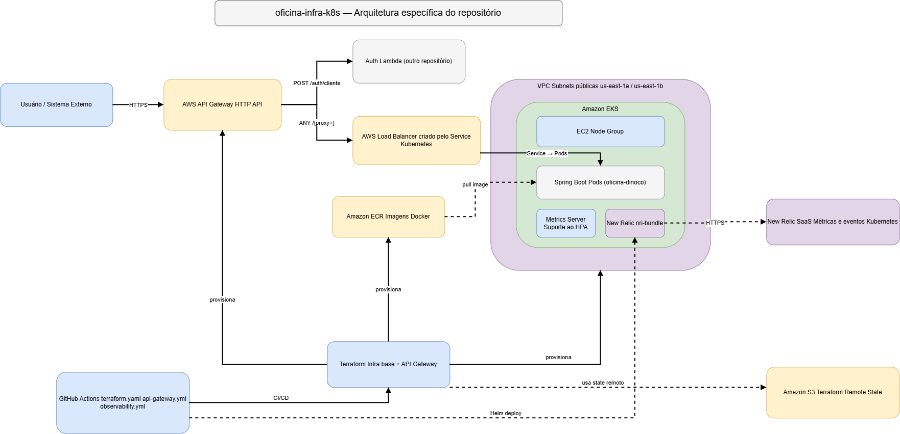

# ☁️ Oficina Dinoco - Infraestrutura Kubernetes, API Gateway e Observabilidade

Repositório responsável pela infraestrutura AWS utilizada pela solução **Oficina Dinoco**, com foco em rede, Kubernetes/EKS, registro de imagens, API Gateway e observabilidade do cluster.

Este repositório foi separado da aplicação principal para permitir ciclos independentes de provisionamento e evolução da infraestrutura.

---

## 🎯 Objetivo do repositório

Este repositório é responsável por:

- provisionar a VPC e Subnets da solução;
- criar Internet Gateway e rotas de rede;
- provisionar o Amazon EKS;
- criar o EC2 Node Group do cluster;
- criar o Amazon ECR utilizado pela aplicação;
- instalar o Kubernetes Metrics Server;
- disponibilizar a infraestrutura necessária para uso do HPA;
- provisionar o AWS API Gateway;
- integrar o API Gateway com a Auth Lambda e com a aplicação no EKS;
- instalar a integração Kubernetes do New Relic;
- manter estados Terraform separados para EKS e API Gateway.

> A aplicação Spring Boot, o banco PostgreSQL e a Lambda de autenticação são mantidos em repositórios próprios.

---

## 🏗️ Arquitetura específica deste repositório



O repositório mantém três blocos principais:

1. **Infraestrutura base** — VPC, Subnets, EKS, EC2 Node Group e ECR.
2. **Entrada da solução** — API Gateway e suas integrações.
3. **Observabilidade Kubernetes** — New Relic Kubernetes Integration instalada no cluster.

O fluxo principal é:

```text
Usuário / Sistema Externo
          |
          v
     API Gateway
       /      \
      /        \
Auth Lambda   Load Balancer
                 |
                 v
                EKS
                 |
        Spring Boot Pods

Dentro do EKS:
- Metrics Server
- HPA
- New Relic Kubernetes Integration (nri-bundle)
```

---

## 📁 Estrutura do repositório

```text
oficina-infra-k8s/
├── .github/
│   └── workflows/
│       ├── terraform.yaml
│       ├── api-gateway.yml
│       └── observability.yml
│
├── observability/
│   └── newrelic-values.yaml
│
├── terraform/
│   ├── backend.tf
│   ├── ecr.tf
│   ├── eks.tf
│   ├── locals.tf
│   ├── network.tf
│   ├── outputs.tf
│   ├── providers.tf
│   └── .terraform.lock.hcl
│
├── terraform-api-gateway/
│   ├── api-gateway.tf
│   ├── backend.tf
│   ├── outputs.tf
│   ├── providers.tf
│   ├── remote-states.tf
│   ├── variables.tf
│   └── .terraform.lock.hcl
│
├── .gitignore
└── README.md
```

---

## ☁️ Recursos provisionados

### Infraestrutura Kubernetes

A pasta `terraform/` provisiona:

```text
VPC
├── Subnet pública A
├── Subnet pública B
├── Internet Gateway
└── Route Table

EKS
├── Control Plane
└── EC2 Node Group

ECR
└── Repositório Docker da aplicação
```

O Node Group utiliza instâncias EC2 para executar os Pods da aplicação.

### API Gateway

A pasta `terraform-api-gateway/` mantém o Terraform do API Gateway em state independente.

Principais rotas:

```text
POST /auth/cliente
        ↓
AWS Lambda

ANY /{proxy+}
        ↓
Load Balancer
        ↓
Service Kubernetes
        ↓
Spring Boot / EKS
```

A separação do state do API Gateway evita acoplamento com o ciclo de vida da infraestrutura principal do EKS.

---

## 📊 Metrics Server e HPA

O Kubernetes Metrics Server é instalado para fornecer métricas utilizadas pelo Horizontal Pod Autoscaler.

Exemplo da configuração atual da aplicação:

```text
Mínimo: 1 réplica
Máximo: 3 réplicas
CPU alvo: 70%
```

Comandos úteis:

```bash
kubectl top nodes
kubectl top pods
kubectl get hpa
```

> O manifesto do HPA da aplicação permanece no repositório `oficina-dinoco`. Este repositório disponibiliza a infraestrutura e as métricas necessárias para seu funcionamento.

---

## 📈 Observabilidade com New Relic

A observabilidade Kubernetes é instalada através do workflow:

```text
.github/workflows/observability.yml
```

e configurada pelo arquivo:

```text
observability/newrelic-values.yaml
```

A instalação utiliza o Helm chart `newrelic/nri-bundle`.

Os componentes executados dentro do EKS coletam informações como:

- CPU e memória;
- nodes;
- Pods e containers;
- quantidade de réplicas;
- restarts;
- estado dos recursos Kubernetes;
- eventos do cluster.

Os dados coletados são enviados para o **New Relic SaaS**.

Fluxo simplificado:

```text
Amazon EKS
├── Aplicação
├── Metrics Server
└── New Relic Kubernetes Integration
        |
        | HTTPS
        v
   New Relic SaaS
```

### Secret necessário

O workflow de observabilidade utiliza:

```text
NEW_RELIC_LICENSE_KEY
```

armazenado como GitHub Repository Secret.

### Instalação manual

Caso necessário:

```bash
helm repo add newrelic https://helm-charts.newrelic.com
helm repo update

helm upgrade --install newrelic-bundle newrelic/nri-bundle   --namespace newrelic   --create-namespace   --values observability/newrelic-values.yaml   --set global.licenseKey="$NEW_RELIC_LICENSE_KEY"
```

Verificação:

```bash
kubectl get pods -n newrelic
```

---

## 🔄 Terraform Remote State

Os estados Terraform são armazenados remotamente no Amazon S3.

Principais states relacionados à solução:

```text
infra/k8s/terraform.tfstate
infra/db/terraform.tfstate
infra/auth-lambda/terraform.tfstate
infra/api-gateway/terraform.tfstate
```

Neste repositório:

- `terraform/` utiliza o state da infraestrutura Kubernetes;
- `terraform-api-gateway/` utiliza state próprio e consulta outputs de outros componentes quando necessário.

> O bucket S3 utilizado como backend precisa existir antes do primeiro `terraform init`. O bootstrap desse bucket deve ser tratado separadamente do Terraform que depende dele.

---

## 🚀 CI/CD

Este repositório possui três workflows principais.

### `terraform.yaml`

Responsável pela infraestrutura base:

```text
Checkout
   ↓
AWS Credentials
   ↓
Terraform Setup
   ↓
terraform fmt / validate
   ↓
terraform init
   ↓
terraform plan
   ↓
terraform apply
   ↓
configura kubectl
   ↓
instala Metrics Server
```

Em Pull Requests são executadas validações e `terraform plan`.

O `terraform apply` é executado após merge/push na `main`.

### `api-gateway.yml`

Responsável exclusivamente pelo API Gateway.

Fluxo:

```text
Checkout
   ↓
AWS Credentials
   ↓
Terraform Setup
   ↓
terraform init / validate
   ↓
configura kubectl
   ↓
descobre Load Balancer da aplicação
   ↓
terraform plan
   ↓
terraform apply
```

O hostname do Load Balancer é obtido dinamicamente:

```bash
kubectl get svc oficina-api-service   -o jsonpath='{.status.loadBalancer.ingress[0].hostname}'
```

e fornecido ao Terraform como `backend_url`.

### `observability.yml`

Responsável pela integração Kubernetes do New Relic.

Fluxo:

```text
Checkout
   ↓
AWS Credentials
   ↓
Configura kubeconfig
   ↓
Helm repo New Relic
   ↓
helm upgrade --install
   ↓
Valida Pods no namespace newrelic
```

---

## 🧪 Execução manual - infraestrutura EKS

Configure o profile do AWS LAB se necessário:

```powershell
$env:AWS_PROFILE="profile"
```

Entre na pasta:

```bash
cd terraform
```

Execute:

```bash
terraform fmt
terraform fmt -check
terraform init
terraform validate
terraform plan
terraform apply
```

---

## 🧪 Execução manual - API Gateway

A aplicação precisa estar executando no EKS e possuir um Service do tipo `LoadBalancer`.

Obtenha o hostname:

```powershell
$LB_HOST = kubectl get svc oficina-api-service `
  -o jsonpath='{.status.loadBalancer.ingress[0].hostname}'

$BACKEND_URL = "http://$LB_HOST"
```

Entre na pasta:

```bash
cd terraform-api-gateway
```

Execute:

```powershell
terraform fmt
terraform init
terraform validate

terraform plan `
  -var="backend_url=$BACKEND_URL"

terraform apply `
  -var="backend_url=$BACKEND_URL"
```

---

## 🧭 Ordem de provisionamento do AWS LAB

Após um reset do AWS Academy, a ordem recomendada é:

Criar o bucket para states do terraform 

```text
1. oficina-infra-k8s
   VPC + EKS + ECR

2. oficina-infra-db
   PostgreSQL RDS

3. oficina-auth-lambda
   Lambda + integração VPC + Secrets

4. oficina-dinoco
   Build + Docker + ECR + Deployment + Service

5. oficina-infra-k8s
   Workflow do API Gateway

6. oficina-infra-k8s
   Workflow de Observabilidade
```

O API Gateway é aplicado depois porque depende da Lambda existente e do Load Balancer da aplicação.

A observabilidade pode ser instalada após o cluster EKS estar disponível.

---

## 🔎 Comandos úteis Kubernetes

```bash
aws eks update-kubeconfig   --region us-east-1   --name oficina-api-dev-cluster

kubectl get nodes
kubectl get pods
kubectl get svc
kubectl get deployment
kubectl get hpa
kubectl top nodes
kubectl top pods
kubectl get pods -n newrelic
```

---

## 🗑️ Destruição do ambiente

Antes de destruir o EKS, remova recursos Kubernetes que criam infraestrutura externa na AWS, principalmente o Service do tipo `LoadBalancer`.

```bash
kubectl delete service oficina-api-service
```

Confirme:

```bash
kubectl get svc -A
kubectl get ingress -A
```

Somente depois execute o destroy da infraestrutura.

Em ambientes do AWS Academy também pode ser utilizado o mecanismo de **Reset do LAB**.

---

## 🔒 Segurança

Nenhuma credencial AWS deve ser versionada no Git.

Os workflows utilizam GitHub Repository Secrets:

```text
AWS_ACCESS_KEY_ID
AWS_SECRET_ACCESS_KEY
AWS_SESSION_TOKEN
NEW_RELIC_LICENSE_KEY
```

Arquivos Terraform locais também não devem ser versionados:

```text
.terraform/
*.tfstate
*.tfstate.*
```

O arquivo `.terraform.lock.hcl` deve permanecer versionado.

---

## 📌 Estado atual

A infraestrutura deste repositório atualmente suporta:

```text
✅ VPC
✅ Subnets
✅ Internet Gateway
✅ Amazon EKS
✅ EC2 Node Group
✅ Amazon ECR
✅ Kubernetes Metrics Server
✅ Suporte ao HPA
✅ Load Balancer da aplicação
✅ AWS API Gateway
✅ Roteamento API Gateway → Auth Lambda
✅ Roteamento API Gateway → Spring Boot / EKS
✅ Terraform Remote State
✅ CI/CD da infraestrutura
✅ CI/CD do API Gateway
✅ New Relic Kubernetes Integration
✅ Monitoramento de CPU, memória, Pods, restarts e eventos Kubernetes
```

---

## 🔗 Repositórios relacionados

- **`oficina-dinoco`** — aplicação Java/Spring Boot e manifestos Kubernetes.
- **`oficina-infra-db`** — PostgreSQL RDS e infraestrutura do banco.
- **`oficina-auth-lambda`** — autenticação serverless de clientes por CPF.

A documentação arquitetural completa da solução é mantida no repositório principal `oficina-dinoco`.
